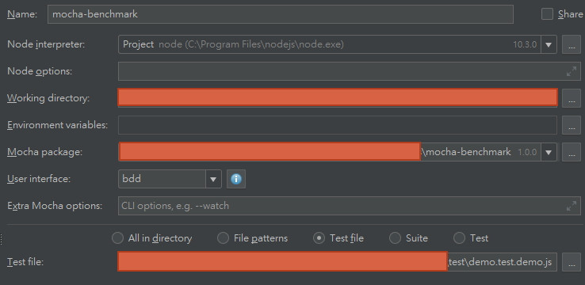

# Mocha + Benchmark integration

    Mocha + Benchmark + Chai, support sync and async test

# install

```nodemon
npm i mocha-benchmark2 mocha chai benchmark microtime
```

* [benchmark](https://www.npmjs.com/package/benchmark)
* [chai](https://www.npmjs.com/package/chai)
* [mocha](https://www.npmjs.com/package/mocha)

# usage

```nodemon
mocha --require mocha-benchmark2/register test/demo.test.demo.js
```


> u can use this with normal mocha test at same time

```nodemon
mocha --require mocha-benchmark2/register "!(node_modules|demo)/**/*.+(test|spec).js" test/demo.test.demo.js
```

## lazy cli

> this cli help u skip `--require mocha-benchmark2/register`

```nodemon
mocha-benchmark2 "!(node_modules|demo)/**/*.+(test|spec).js" test/demo.test.demo.js
```

## ide support (ex: idea)




## register

when u require `mocha-benchmark2/register`

> will auto try import if u have installed  
> this will not overwrite if it already exists in global

- `assert` => `chai.assert` or node.js `assert`
- `should` => `chai.should`
- `expect` => `chai.expect`
- `MochaBenchmark` => `mocha-benchmark2`
- `Benchmark` => `benchmark`

## API

* [mocha_benchmark.d.ts](mocha_benchmark.d.ts)

## demo

* [demo.test.demo.ts](test/demo.test.demo.ts)
* [integration.test.ts](test/integration.test.ts)

```ts
/**
 * Created by user on 2018/6/2/002.
 */
import MochaBenchmark, { getDefaultOptions } from 'mocha_benchmark2';

import { relative, expect } from './_local-dev'

let bench = MochaBenchmark.create({
	versions: [
		/* order can be important when we introduce test failing options */
		[
			'previous', {
			aaa: 777,
		}
		],
		[
			'latest', {
			aaa: 888,
		}
		]
	],

	prefix: '[this is prefix]',
});

bench.suite(relative(__filename), function (topLevelContext, topLevelData)
{

	topLevelContext.test('top async', async function (deferred, currentData, currentContext)
	{

	});

	topLevelContext.test('top sync', function (...argv)
	{
//			expect(1).to.equal(3);
	});

	// sub level
	topLevelContext.compare('sub', function (currentContext, currentData)
	{

		currentContext.test('async', async function (deferred, currentData, currentContext)
		{
			expect(1).to.equal(3);
		});

		let b;

		currentContext.test('sync', function (...argv)
		{
//			expect(1).to.equal(3);
		});

	})

	// same level
	topLevelContext.compare(function (currentContext, currentData)
	{
		currentContext.test('same async', async function (deferred, currentData, currentContext)
		{
			//expect(1).to.equal(3);
		});

		currentContext.test('same sync', function (...argv)
		{
//			expect(1).to.equal(3);
		});
	})

});

```

## others

* [README.old](README.old.md)

