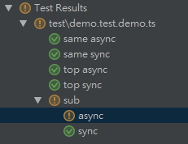
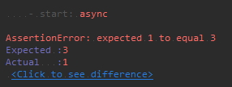

# Mocha + Benchmark integration

    Mocha + Benchmark + Chai, support sync and async test

# install

```nodemon
npm i mocha-benchmark2 mocha chai benchmark microtime
```

# usage

```nodemon
mocha --require mocha-benchmark2/register test/demo.test.demo.js
```




> u can use this with normal mocha test at same time

```nodemon
mocha --require mocha-benchmark2/register "!(node_modules|demo)/**/*.+(test|spec).js" test/demo.test.demo.js
```

## register

when u require `mocha-benchmark2/register`

> will auto try import if u have installed  
> this will not overwrite if it already exists in global

- `assert` => `chai.assert` or node.js `assert`
- `should` => `chai.should`
- `expect` => `chai.expect`
- `MochaBenchmark` => `mocha-benchmark2`
- `Benchmark` => `benchmark`

## demo

* [demo.test.demo.ts](test/demo.test.demo.ts)
* [integration.test.ts](test/integration.test.ts)

## others

* [README.old](README.old.md)

